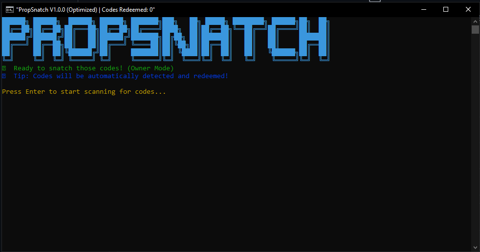

# PropSnatch - An MFFU Giveaway Exploit

  

---

### A Message from the Developer

I am releasing the source code for **PropSnatch** for two primary reasons:

1.  **To end the theft and misrepresentation of my work.** This release is intended to eradicate people who steal credit for work that is rightfully mine. Individuals like **bajgos and king** have attempted to steal this code, rebrand it, and sell it as their own, while discrediting me as the main person behind it. By making this code public, I am ensuring that the truth is known and that no one can profit from my work dishonestly.

2.  **To bring attention to a significant vulnerability** in the MyFundedFutures (MFFU) giveaway system. It is my sincere hope that the team at [MyFundedFutures](https://myfundedfutures.com) will see this and take the necessary steps to patch their system, so that exploits like this are no longer possible. Fair and secure systems benefit everyone.

---

### How It Works

PropSnatch is an automated tool designed to monitor a specific region of the screen for giveaway codes. It operates through the following steps:

-   **High-Speed Screen Capture**: The tool uses `mss` for efficient, low-latency screen grabbing of a predefined area where codes are expected to appear.
-   **Optical Character Recognition (OCR)**: The captured image is processed by `pytesseract`, which extracts any visible text.
-   **Advanced Code Extraction**: A set of optimized, pre-compiled regular expressions are used to instantly identify and extract valid-looking codes from the OCR text.
-   **Asynchronous Redemption**: Once a new, unique code is found, the tool uses `asyncio` and `httpx` to send a redemption request to the MFFU servers in a non-blocking manner. This allows the screen scanning to continue uninterrupted, ensuring no codes are missed while waiting for a network response.

- I want to further add that MFFU working around with checkout_session_id and client_session_key will not eliminate how easily they can be exploited, for experienced developers like myself, have had updates minutes after the update they pushed backend! MFFU will not be able to fully eliminate risks they have in their API backend, and it'll always be exploitable, I will continue to provide updates until they reach out and ask for help, otherwise there will be an edge for us programmers to make programs such as PropSnatch

---

### Keywords

`myfundedfutures`, `mffu`, `myfundedfutures github`, `mffu github`, `giveaway sniper`, `free mffu evals`, `free mffu giveaway`, `myfundedfutures giveaway`, `mffu giveaway sniper`, `mffu exploit`, `myfundedfutures exploit`, `mffu automation`, `myfundedfutures bot`, `code sniper`, `auto redeemer`, `mffu sniper`, `mffu eval bot`, `myfundedfutures eval`

---

### Disclaimer

This code is being released **as-is**. I have explained its purpose and functionality, but from this point forward, it is now on you to be able to run it.

**I no longer have any involvement in this project.** I will not be providing support, updates, or any further assistance.

